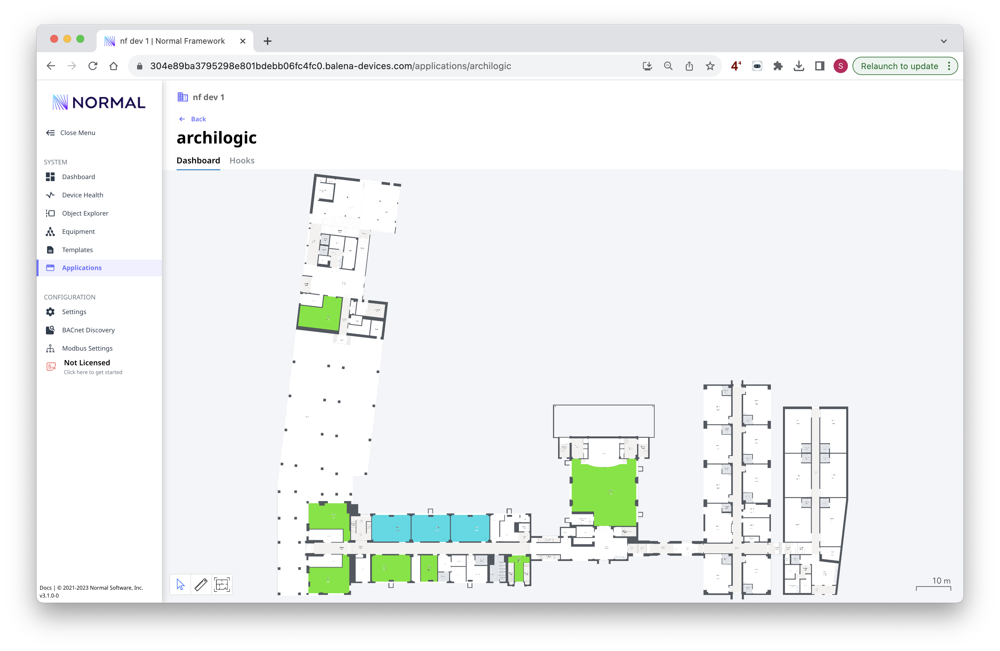

# Archilogic App

This app has an example integration with the [Archilogic](https://www.archilogic.com/) platform, which provides support for the full lifecycle of building floor plans; as well as a powerful SDK for embedding them into other applications.

By default, this app loads a demo floor plan and looks for temperature data.  Any rooms where the Archilogic `customId` field matches the `equipRef` will be colored with a colormapped value.

